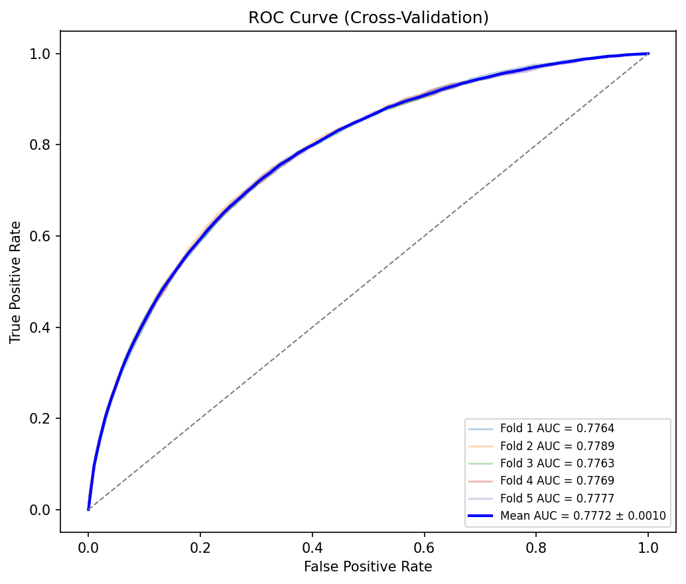
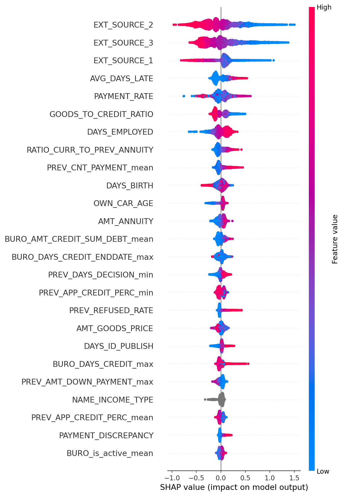
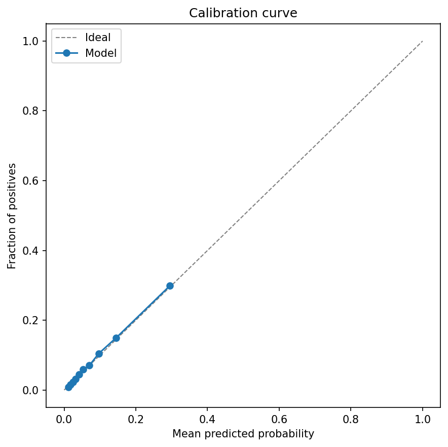
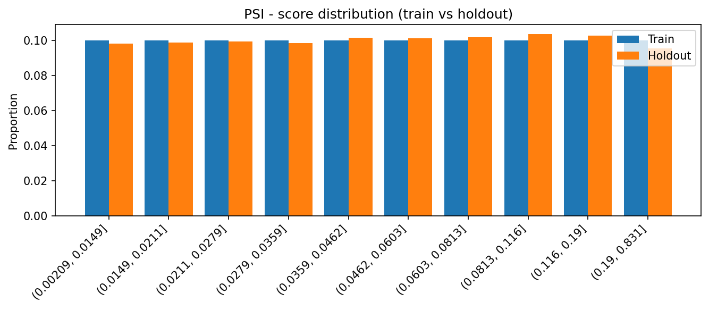
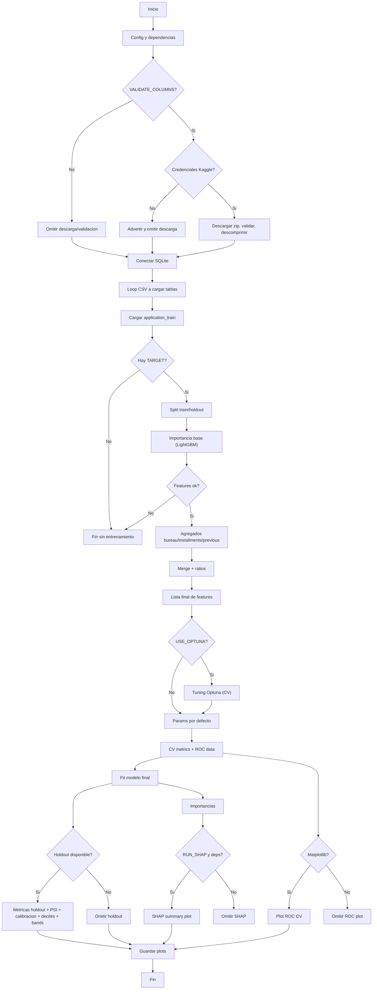

# Modelo de riesgo de crédito potenciado con Machine Learning
Este proyecto de riesgo crediticio, potenciado con machine learning (LGBM Classifier), está listo para producción bancaria. A diferencia de los enfoques puramente académicos centrados únicamente en maximizar el AUC, este desarrollo prioriza la estabilidad financiera (PSI), la interpretabilidad regulatoria y el impacto directo en el negocio.

## Resumen ejecutivo
| Métrica | Resultado | Interpretación de negocio |
|---------|-----------|---------------------------|
| **Poder predictivo** | AUC: 0.78, KS: 42.4% | Alta capacidad para distinguir entre buenos y malos pagadores |
| **Estabilidad** | PSI: 0.001 | El modelo es extremadamente robusto; no degrada su rendimiento con datos nuevos al comparar Train vs Holdout |
| **Calibración** | Excelente en 30% | Las probabilidades emitidas son reales, lo cual permite un *Risk-Based Pricing* directo |
| **Interpretabilidad** | Fair Lending compliant e interpretable | La variable "género" de la persona se eliminó, aunque fuera una variable con fuerte poder predictivo, para cumplir normativas de antidiscriminación. Además, se usa SHAP para dar explicabilidad a los resultados obtenidos del modelo. Permite explicar al cliente por qué fue aceptado o rechazado su solicitud de crédito. |

### Beneficios de negocio
No solo se enfoca en la predicción y la precisión AUC. El modelo también actúa como un potente motor de decisión automatizado. Segmenta en deciles a los usuarios y calcula su riesgo de impago, lo cual es útil para maximizar la admisión de clientes seguros y controlar la mora.

| Grupo | Riesgo | Acción |
|-------|--------|--------|
| Rojo | >15% de tasa de impago | Denegar crédito inmediatamente |
| Gris | >10% y ≤15% | El riesgo está en el límite del apetito de riesgo. Un analista humano debería corroborar |
| Verde | ≤10% | Automatización del 76% de solicitudes, reduciendo drásticamente la carga operativa y mejorando la experiencia del cliente |

### Metodología
**Principal**: Utilización de Python para el proceso ETL y uso de machine learning.

**Data**: Proveniente de SQLite para manejar estructuras comúnmente usadas en banca.

**Optimización de hiperparámetros**: Optimización bayesiana de hiperparámetros con Optuna (TPE) con validación cruzada

**Explicabilidad**: SHAP

## Análisis del modelo
El modelo fue diseñado para ser potente predictivamente y respetar los requisitos de explicabilidad regulatoria. Se utilizan valores SHAP para desglosar los drivers de riesgo. Además, los resultados AUC en los 5 folds muestran gran estabilidad, con poca desviación, lo que significa que el modelo no depende de un fold en específico y mantiene un buen comportamiento con todos los datos.

> *Análisis: Las variables como scores externos son los predictores más fuertes. También se observa una consistencia lógica económica: una mayor antigüedad en el empleo reduce drásticamente el riesgo de impago.*
>  
> *La variable de género fue removida intencionalmente para cumplir con las normas de antidiscriminación.*

## Confiabilidad y calibración
El modelo es preciso al asignar probabilidades de tasa de impago, lo cual es importante para definir tasas de interés del préstamo.

> *Análisis: La curva de calibración muestra un ajuste casi perfecto a la curva ideal, lo que significa que la probabilidad predicha corresponde a la probabilidad real de impago.*

## Estabilidad en Producción
Análisis de estabilidad poblacional comparando el conjunto de entrenamiento vs holdout.

> *Análisis: El PSI global es < 0.01. Como se observa en el gráfico, la distribución de los scores es prácticamente idéntica entre entrenamiento y validación. Esto garantiza que el modelo no ha memorizado ruido del entrenamiento.*

## Flujo de trabajo e implementación técnica
El proyecto se realizó simulando un entorno real de datos bancarios, priorizando SQL para el procesamiento.

- Uso de SQLite para manejar relaciones entre tablas transaccionales
- **Carga de datos**: Los datos se cargan por chunks para evitar saturación de RAM
- **Framework**: Optuna, con opción de activar o desactivar, ejecutado sobre validación cruzada
- **Estrategia**: Validación cruzada estratificada (5 folds)
- **Objetivo**: Maximizar ROC-AUC sin incumplir normativas regulatorias

### Automatización de selección de variables
Se automatiza la selección de variables entrenando un modelo base, del cual se escogen las primeras 50 variables con mayor importancia para reducir ruido y mejorar la explicabilidad del modelo. Además, se integran diferentes tablas para obtener la mayor cantidad de variables relevantes.  
Se establece un marco riguroso de validación separando en 5 folds para entrenamiento y su correspondiente validación fuera del fold de entrenamiento. Desde el inicio se define un holdout para medir el performance, evitar *data leakage* e inflar métricas.

## Métricas de negocio
El proyecto busca simular un entorno de producción real, donde el modelo sea útil y funcional para el negocio bancario. Por ello, también se evalúan métricas de alto valor para el negocio:

- **Population Stability Index (PSI)**: Se obtuvo un resultado inferior a 0.001, lo que indica distribuciones prácticamente idénticas y confirma que las poblaciones entre entrenamiento y test son muy similares.
- **Curva de calibración**: Verifica si las probabilidades estimadas por el modelo se alinean con las probabilidades reales, siendo clave para la definición de tasas de interés. El modelo obtuvo resultados sólidos, con probabilidades predichas muy cercanas a las reales, por lo que no requiere ajustes adicionales.
- **Segmentación de usuarios**: El modelo segmenta a los usuarios por tasa de impago, permitiendo automatizar aproximadamente el 76% de las solicitudes.

